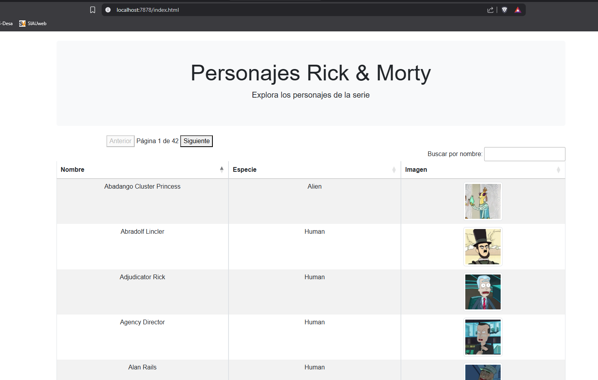

# PARA EJECUTAR LA APLICACIÓN apiRickAndMorty:

1- Instalar java jdk 1.8 o superior.

	https://www.openlogic.com/openjdk-downloads

---   

2- Establecer la varaible de entorno JAVA_HOME a la carpeta de instalación de java. Ejemplo: JAVA_HOME=C:\Program Files\Java\jdk-11.0.13\
 
   Agregar a la variable de entorno PATH la entrada %JAVA_HOME%\bin. Ejemplo:  PATH=%PATH%;%JAVA_HOME%\bin
   
   Probar la instalación ejecutando los comandos java y javac desde linea de comandos, ambos deben regresar opciones de ejecución de los comandos.
   
---   

3- Eclipse y otros IDEs trae Maven embebido por lo que es necesario descargar uno propio para poder usarlo sin restricciones.

   Descargar Maven de su pagina https://maven.apache.org/download.cgi  Binary zip archive
   
   Descomprimirlo en una carpeta.
   
   Agregar la variable de entorno M2 a donde se descomprimio Maven. Por ejemplo M2=C:\apache-maven-3.3.9
   
   Agregar la variable de entorno M2_HOME y apuntarla a la variable M2 del paso anterior. Por ejemplo: M2_HOME=%M2%
   
   Agregar la variable de entorno M2_HOME a la variable de entorno PATH. Por ejemplo: PATH=%PATH%;%M2_HOME%\bin
   
   Probar la instalación de Maven ejecutando en liena de comandos el comando: mvn
 
---   
   
4- Descargar Spring Tools Suite: https://spring.io/tools#eclipse.
    
   Una vez descargado, descomprimir y ejecutar. Creara una carpeta justo donde lo ejecutamos. Una vez que termine entrar a esa carpeta y ejecutar el archivo SpringToolSuite4.exe
   
   y nos preguntará la carpeta donde será el workspace. Recordar y/o Guardar esta ruta para una siguiente configuración

---  

   

5- En Spring Tools Suite ir al menu Window->Perspective ->Open perspective->Other y escoger la perspectita Git

   En esta perspectiva en el panel izquierdo (Git Repositories) buscar el botón "Clone a Git repository and add the clone to this view

   

   Seleccionar la opcion "Clone URI" y presionar next. En la siguiente ventana ingresar la URL del proyecto en Git en el campo URI https://github.com/aabrahamhs/apiRickAndMorty.git

   

   Tambien ingresar usuario y contraseña de Git. En la siguiente ventana "Branch Seleccion" dejar las opciones por defecto y presionar next

   

   En esta ventana borrar la URL carpeta que aparece en directorio destino excepto la utlima parte y reemplazar la parte inicial con la ruta del workscpace que se guardo previamente

   

   Ejemplo: Aparece C:\Users\MiUsuario\git\MiProyecto reemplazar con C:\RutaDeMiWorkspace\MiProyect

  

  

---  

  

6- Abrir una consola o terminal e ir a la ruta donde quedo el proyecto que se descargo de git. Ejemplo: cd C:\RutaDeMiWorkspace\MiProyect

   Dentro de cada proyecto Maven existe un archivo POM.xml. Donde se encuentre este archivo que normalmente es en la raíz del proyecto ejecutar el siguiente comando:

   

    - Para eclipse=>  mvn eclipse:eclipse

 
---  

7- Despues de este paso ya es posible importar el proyecto descargado de git y que el IDE lo reconozca. Para STS la importación es de la siguiente manera

   Ir la menu File->Import->General->Existing Projects into Workspace y presionar next. Escoger "Select root directory" y escoger la ruta del workspace descargado del git

   

   Ejemplo: C:\RutaDeMiWorkspace\MiProyect

---   

      
8- Dar clic derecho al proyecto->configure->Convert to Maven Proyect 
 
---   

9-  En eclipse dar click derecho al proyecto -> Maven -> Update proyect . En esta ventana seleccionar el check "Force update of Snapshot" y presionar ok. Esto descargará todas las dependencias.

---

10- En eclipse dentro de las carpetas del proyecto buscar dentro de "Maven Dependencies" el jar de lombok. Dar click derecho al jar Run as -> Java Aplication, y aceptar la ejecucion a pesar de los errores

    En la ventana que aparece seleccionar la instalación de eclipse que se esta ejecutando. Si no aparece, buscar el archivo eclipse.exe con el boton Specifi location

    Una vez hecho esto reiniciar STS

---

11- Por ultimo se procede a ejecutar la aplicación. Para ello abrir la clase com.rickandmorty.RickAndMortyApiApplication.java y dar click derecho en el codigo Run as -> Spring Boot App

    Con esto la aplicación ya debe funcionar invocando en el navegador http://localhost:7878/index.html
    

---   

		  
		
   
      

